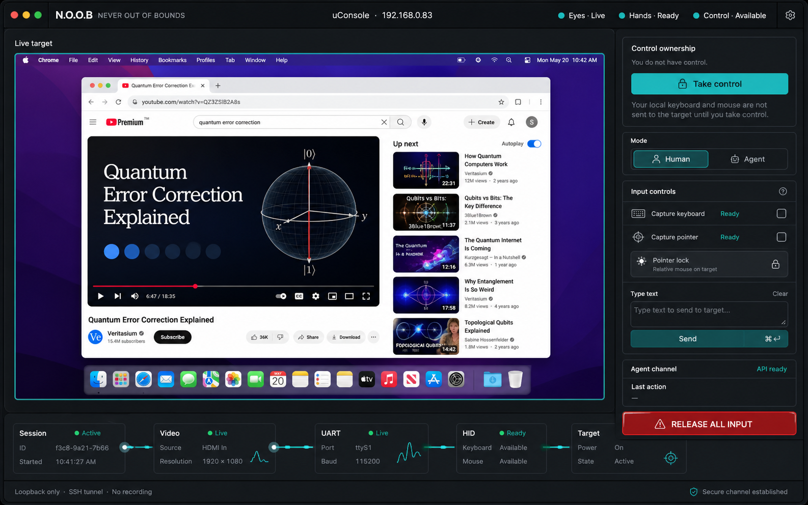
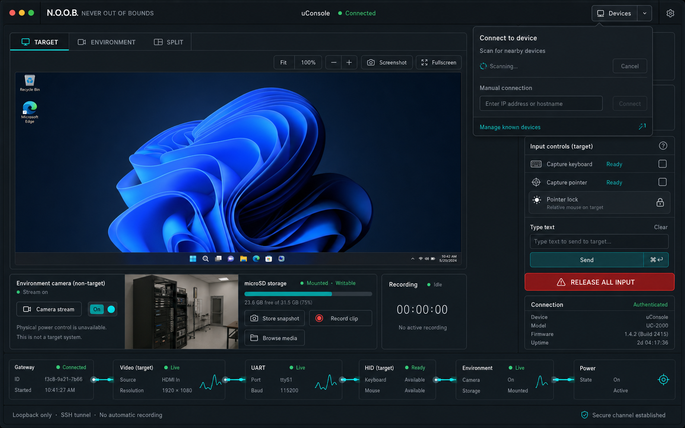

# N.O.O.B. — NEVER OUT OF BOUNDS

<p align="center">
  <strong>When the network is gone, the console is still yours.</strong>
</p>

<p align="center">
  A compact, hardware-in-the-loop console that gives operators and automation<br>
  a live view and native keyboard-and-mouse control of an otherwise unreachable computer.
</p>



> The image above is the operator-console design concept. N.O.O.B. is an
> independent hardware/software prototype and is not affiliated with or
> endorsed by any hardware vendor.

## The field console for the machines that cannot phone home

Remote support tools are excellent—right up until the operating system stops,
the network disappears, the VPN breaks, or the machine has never been
provisioned. N.O.O.B. moves the control plane outside the target:

- **Eyes:** HDMI enters a USB capture adapter and becomes a live operator feed.
- **Hands:** a Raspberry Pi Pico WH presents an ordinary USB keyboard and mouse
  to the target.
- **Bridge:** a ClockworkPi uConsole runs the authenticated video and input
  gateway.
- **Control:** a human can use the uConsole itself or the desktop operator;
  authorized agents use the same bounded lease and command path.

The target needs no network, installed agent, driver package, login session, or
working remote-management stack. For a target that presents a compatible HDMI
signal and accepts standard USB HID, N.O.O.B. forms an independent console path
around its normal control plane.

Think of it as a pocketable crash cart built for repeatable operations: small
enough for a field kit, explicit enough for an audit trail, and constrained
enough that “remote keyboard” never quietly becomes “remote shell.”

## What it can do

- **See the real target.** Serve fresh JPEG and MJPEG output decoded from a
  stable V4L2 capture identity.
- **Choose truthful capture output.** Switch among hardware-validated MJPEG
  profiles from either operator UI while the gateway reports requested and
  actually negotiated dimensions separately.
- **Drive native USB HID.** Type text, send bounded key combinations, move the
  pointer, and preserve true button down/up behavior for click, hold, and drag.
- **Work from the appliance.** Explicitly arm the uConsole keyboard and
  trackball as an exclusive local controller; left and right buttons retain
  their native identities and the ball press remains middle-click.
- **Work from a modern desktop.** Use the Electron operator for live video,
  ownership state, human/agent mode, proof-layer status, and emergency input
  release.
- **Give agents a narrow control surface.** Authenticated HTTP endpoints accept
  fixed input envelopes and current-frame requests—never arbitrary shell,
  filesystem, process, clipboard, or raw USB-report access.
- **Add independent environmental context.** An optional ESP32-CAM can provide
  a second, clearly labeled non-target view with logical stream control,
  fullscreen/zoom/screenshot tools, and explicit microSD snapshots or bounded
  clips. It never substitutes for HDMI target proof.
- **Find the appliance without memorizing an address.** The operator and MCP
  plugin can discover the uConsole over a bounded `_noob-kvm._tcp` hint, while
  manual private-address pairing and independent SSH host-key verification
  remain available.
- **Fail closed.** Session replacement, stale leases, malformed input, UART
  uncertainty, device loss, watchdog expiry, and process shutdown all converge
  on releasing held input.
- **Recover without guessing.** Stable `/dev/*/by-id` identities and separate
  readiness signals prevent a replug from silently binding the wrong device.

## How N.O.O.B. works

```text
 Human operator or authorized agent
                 |
                 | SSH tunnel + authenticated HTTP
                 v
       ClockworkPi uConsole gateway
          (Kali Linux, loopback only)
                 |
          +------+--------------------+
          |                           |
          | V4L2 video                | 115200 8N1 UART
          v                           v
  USB HDMI capture              Adafruit FT232H
          ^                           |
          | HDMI                     | D0 / D1 / GND only
          |                           v
    Target computer <---------- Raspberry Pi Pico WH
                                  native USB HID

 uConsole keyboard + trackball
                 |
                 | authenticated arm + exclusive evdev grab
                 +----------> same lease / UART / Pico path
```

The video and control paths remain deliberately independent. A healthy HTTP
process is not a decoded frame; a UART acknowledgement is not visible target
acceptance. N.O.O.B. keeps those proof layers separate so the operator can tell
the difference.

An adapter can advertise HDMI input capability separately from the frames it
emits over USB. On the current hardware, true 3840 × 2160 capture output is not
available; the highest advertised conventional 16:9 output is 2560 × 1440
MJPEG. The interfaces therefore call this setting **Capture Output**, never
promise automatic target matching, and expose only profiles proven on the
attached appliance. A device marketed for “4K input” is not represented as a
4K capture path.

The reference MacroSilicon appliance has passed bounded live switching and
fresh-frame identity checks at 1280×720/20, 1280×720/30, 1920×1080/30,
1920×1200/30, 2560×1440/30, and 2560×1600/30. These are capture-output modes;
they do not prove that the target's HDMI source is using the same timing, and
the higher modes still require the closed-case soak described in
[Acceptance](docs/acceptance.md).

## Current reference hardware

The working prototype uses readily available modules rather than a custom PCB:

| Role | Reference component | Operational note |
| --- | --- | --- |
| Appliance | ClockworkPi uConsole with Raspberry Pi CM4 | Runs Kali Linux and the N.O.O.B. gateway |
| USB expansion | Powered-capable USB hub | Carries capture and FT232H devices |
| Video input | MacroSilicon USB HDMI capture adapter | Resolved through `/dev/v4l/by-id`; capture node must be verified |
| Serial bridge | Adafruit FT232H breakout | 3.3 V TTL UART; physical **I2C switch OFF** |
| HID controller | Raspberry Pi Pico WH | Runs CircuitPython and enumerates as USB keyboard + mouse |
| Signal wiring | Three female DuPont jumpers | `D0`, `D1`, and `GND` only |
| Target links | HDMI and USB data cables/adapters | Match the target's available display and USB ports |

### Wiring

```text
FT232H D0 / TX  ──> Pico GP1 / UART0 RX
FT232H D1 / RX  <── Pico GP0 / UART0 TX
FT232H GND      ─── Pico GND
```

Disconnect both USB power sources before changing wiring. Do **not** connect
FT232H `5V` or `3V` to a Pico power pin: each board is powered through its own
USB connection. These are 3.3 V TTL UART signals, not DB9/RS-232 levels.

## Operator experience

The desktop operator is designed around one question: **what is proven right
now?** Its live target view sits beside explicit control ownership, human/agent
mode selection, bounded input tools, the uConsole-control arming state, and a
prominent global release action. A proof rail reports video, UART, HID, and
session state independently.

The gateway defaults to `127.0.0.1:8765`. The desktop reaches it through an SSH
forward and still supplies the gateway bearer token. The token and active lease
stay in Electron's main process; they are not placed in renderer storage. An
optional inherited-stdin bootstrap avoids putting the token in arguments,
environment variables, the clipboard, or shell history.

For normal Mac operation, **Take control** is one action: the app requests
relative pointer lock from that trusted click, releases any uConsole-local
input grab, verifies the handoff, claims the remote lease, and enables keyboard
and pointer capture together. The individual capture controls remain available
as advanced opt-out and recovery controls. Pressing **Escape**, leaving the
operator window, losing the lease, or using the global release action clears
the complete input state.

The built-in uConsole controls are a separate mode. They remain inert until an
authenticated arm request succeeds, then the configured keyboard and trackball
are grabbed together so one physical event cannot affect both the appliance
desktop and the target. Pressing **Ctrl+Alt+Esc** on the uConsole disarms them
locally; the reserved chord is never forwarded.

For walk-up work, the [appliance-local console](docs/local-console.md) keeps the
target video on the uConsole without claiming the remote input lease. It can be
pinned above XFCE, switched full-screen, or hidden back to the desktop; local
and desktop operators may observe the same stream while the gateway still
enforces one input owner.

The optional [environmental camera lane](docs/environment-camera.md) is kept
visually and cryptographically separate from target HDMI. Both operator
surfaces can switch between Target and Environment, zoom or fullscreen the
selected feed, download a local screenshot, and explicitly store or review
camera-owned microSD media. Camera reachability, hardware identity, fresh
frame evidence, storage state, and target readiness remain separate proofs.



> Product-interface concept: the implemented controls follow this separation,
> but live values and target imagery always come from the connected hardware.

Both interfaces select the same gateway-owned capture profile. The gateway
stops the old V4L2 process before starting the replacement, verifies the
negotiated format and a fresh JPEG, and rolls back on mismatch. Resolution
changes are blocked while any local or remote controller owns input so the
operator cannot intentionally lose the “eyes” while the “hands” are active.

## Trust boundaries, not trust slogans

N.O.O.B. treats an out-of-band keyboard as a privileged interface:

1. **Network boundary.** The gateway binds to loopback by default. Remote
   operators use an SSH tunnel and application authentication.
2. **Ownership boundary.** One short-lived controller lease owns input at a
   time. Local, Electron, and agent controllers cannot silently preempt one
   another.
3. **Command boundary.** The API and Pico accept bounded, enumerated JSON
   commands. There is no arbitrary command-execution endpoint.
4. **Serial boundary.** Every request carries a session ID and sequence number
   and receives an `ACK` or bounded `NACK`. Duplicate sequence IDs are
   acknowledged without replaying HID.
5. **USB boundary.** The Pico emits native HID and independently releases held
   input when its controller disappears.
6. **Observation boundary.** Frames are kept in memory and are not recorded by
   default. Typed content, frames, tokens, credentials, and authorization
   headers are not written to logs.
7. **Physical boundary.** Local input accepts only configured stable
   `/dev/input/by-id` or `/dev/input/by-path` identities. The reference
   deployment also pins verified serial and video identities; numeric
   `ttyUSB*`, `video*`, and `event*` names are never treated as acceptance
   proof.

See [Architecture](docs/architecture.md) for the complete trust model and
[Recovery](docs/recovery.md) for emergency release, firmware recovery, and
device-loss behavior.

## Quick-start path

N.O.O.B. is currently an engineering prototype, not a one-command consumer
installer. Bring up each proof layer deliberately:

1. **Read the boundaries.** Start with [Architecture](docs/architecture.md),
   [Acceptance](docs/acceptance.md), and [Recovery](docs/recovery.md).
2. **Wire the UART lane.** Power down both boards, connect only `D0`, `D1`, and
   `GND`, and leave the FT232H I2C switch off.
3. **Install Pico firmware.** Put the Pico in BOOTSEL mode and use
   [`scripts/install_pico.sh`](scripts/install_pico.sh) with a pinned Pico W/WH
   CircuitPython UF2 and matching major-version library bundle.
4. **Configure the gateway.** Begin with
   [`config/noob.toml.example`](config/noob.toml.example), replace device paths
   with verified stable identities, provision a protected token file, and keep
   the listener loopback-only.
5. **Run the gateway tests.** From a Python 3.11+ virtual environment:

   ```sh
   python -m pip install -e '.[test]'
   pytest -q
   ```

6. **Start the operator.** Establish a verified SSH forward, then follow
   [`operator/README.md`](operator/README.md) to build and launch the Electron
   app.
7. **Install the independent recovery lane.** Keep `usb0` reachable through
   `systemd-networkd` while NetworkManager owns Wi-Fi by following
   [Appliance network resilience](docs/appliance-network-resilience.md).
8. **Enable optional discovery.** Keep manual private-address pairing as the
   fallback, or install the bounded `_noob-kvm._tcp` SSH advertisement using
   [Appliance discovery](docs/appliance-discovery.md). Discovery never replaces
   independent host-key verification.
9. **Prove the target.** Complete the acceptance ladder with a blank document
   and harmless input. Do not equate device enumeration or an ACK with a
   target-visible result.

Minimal agent-compatible input envelopes are intentionally small:

```json
{"action":"type","text":"hello from noob\n"}
{"action":"combo","keys":["GUI","SPACE"]}
```

Both normalize into the same validated UART protocol used by the human
operator.

## Verified prototype status

The current reference build has demonstrated the core end-to-end path on a
MacBook target:

| Proof layer | Current evidence |
| --- | --- |
| Appliance | Direct SSH access to the Kali uConsole and active systemd gateway service |
| Video | MacroSilicon capture resolved by stable identity; six MJPEG profiles from 1280×720/20 through 2560×1600/30 negotiated and fresh-frame verified |
| UART | FT232H session at 115200 8N1 with request acknowledgements and zero-replay sequencing |
| HID | Pico WH enumerated as native keyboard and mouse; target-visible keyboard, pointer, and button actions |
| Local controls | uConsole keyboard and trackball forwarded through the shared lease; native left, right, and middle mapping retained |
| Desktop operator | Live Electron view, authenticated ownership, safe release, and automatic stream recovery after a gateway restart |
| Agent path | Bounded API opened Chrome, created a tab, navigated to YouTube, and was verified through a fresh capture frame |
| Automated checks | 217 Python gateway/Pico/camera tests (plus 66 subtests), 146 Electron tests across 24 files, and 65 agent-plugin tests across 11 files passing; Electron lint/build/package verification, plugin typecheck/build, lock checks, and both npm dependency audits clean |

This is a working prototype, not a certification claim. The full reboot and
failure-injection matrix in [Acceptance](docs/acceptance.md) remains the bar for
a release candidate; unsupported layers are not reported as complete merely
because a device enumerated.

## Roadmap

- Finish the complete restart, reboot, unplug/replug, and stuck-input acceptance
  matrix on the reference appliance.
- Turn the current module stack into a reproducible appliance installer and
  signed release workflow.
- Design a compact enclosure and purpose-built interconnect that preserves the
  same isolated power and bounded UART model. The
  [protective field-enclosure plan](docs/hardware-enclosure.md) defines the
  current mechanical and acceptance baseline.
- Add lower-latency viewing options without weakening the loopback-first trust
  boundary.
- Package human and agent workflows around the same ownership, proof, and
  emergency-release semantics.
- Expand validated target coverage beyond the initial MacBook bench.

## Repository map

| Path | Purpose |
| --- | --- |
| [`pico/`](pico/) | CircuitPython firmware and bounded HID protocol |
| [`gateway/`](gateway/) | Authenticated video, lease, UART, and local-input gateway |
| [`operator/`](operator/) | Electron human/agent control surface |
| [`camera/`](camera/) | Optional ESP32-CAM firmware, secure provisioning, and direct acceptance tooling |
| [`integrations/noob-plugin/`](integrations/noob-plugin/) | Codex/ChatGPT and Claude-compatible MCP operator plugin |
| [`config/`](config/) | Strict example and reference appliance configuration |
| [`packaging/`](packaging/) | Hardened systemd service template |
| [`tests/`](tests/) | Host-side protocol and gateway tests |
| [`docs/`](docs/) | Architecture, recovery, and acceptance procedures |
| [`design/`](design/) | Operator design system and visual concept |

## Responsible use

N.O.O.B. is intended for authorized recovery, provisioning, lab automation,
field support, and resilience work on systems you own or are explicitly
permitted to operate. Physical USB HID can act before normal endpoint controls
or network policy are available, so protect the appliance, token, SSH identity,
and target cabling as privileged access.

**“Never Out of Bounds” describes availability—not permission.** Keep every
deployment inside its legal, organizational, and human authorization boundary.
